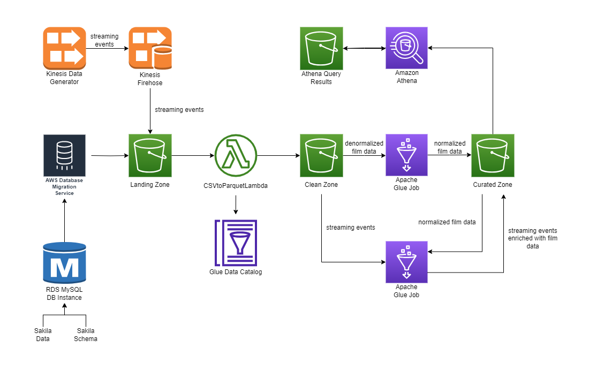
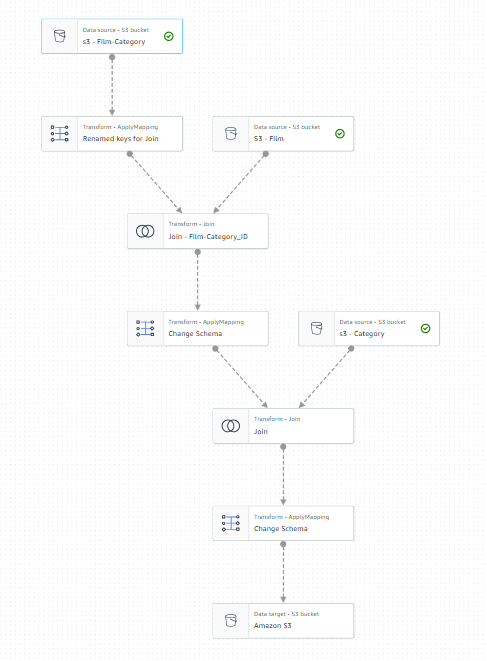
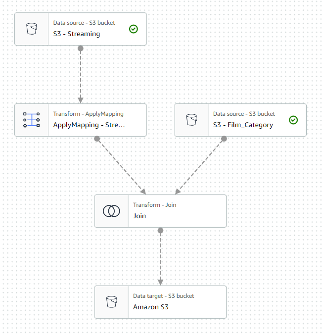
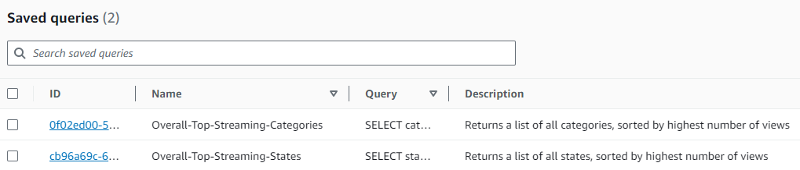

# Sakila Film Streaming: Tranforming Streaming Data for Analytics

A project demonstrating how to ingest and combine static and streaming data, and optimise it for analytics. 

## About the Dataset

This project uses the [Sakila sample database](https://dev.mysql.com/doc/sakila/en/sakila-introduction.html), initially developed by Mike Hillyer in 2005. The dataset was intended to simulate a bricks-and-mortar DVD rental store. The entity relationship diagram can be seen [here](./images/sakila_database_erd.png), and the databases can be downloaded from https://downloads.mysql.com/docs/sakila-db.zip. 

In our project scenario, the company has pivoted to partnering with various streaming platforms to make their movies available for streaming in order to stay competitive. The company receives information about which movies are being streamed from their distribution partners in real time. 

They company's analytics team would like to be able to answer questions about the popularity of titles, in particular broken down by genre and geography.

## Project Architecture

The project is orchestrated on Amazon Web Services:



| Component                    | Purpose                                                                 |
|------------------------------|-----------------------------------------------------------------------------|
| Data Lake                    | consisting of S3 buckets for *landing*, *clean* and *curated* zones         |
| RDS MySQL DB Instance        | loaded with the Sakila SQL schema and data                                  |
| DMS Replication Instance     | for migrating the SQL tables to the data lake                               |
| Kinesis Data Generator       | to create simulated streaming (viewing) events                              |
| Amazon Kinesis Data Firehose | to ingest the streaming data and write it to the data lake                  |
| Lambda Function              | for converting tables from CSV to Parquet format                            |
| Apache Glue                  | for normalizing the film data and enriching streaming events with film data |
| Amazon Athena                | for querying the data catalog                                               |


Below, we explain in further detail how each component was set up, and link to relevant code and configuration where appropriate.

_Note: instances of <SUFFIX> in code snippets refer to a suffix needed to make resource names globally unique._

### Using AWS Lambda to convert CSV to Parquet

We use the open source [AWS Data Wrangler](https://github.com/awslabs/aws-data-wrangler/releases) Python library to convert CSV files which arrive in our _landing zone_ S3 bucket into Parquet files in our _clean zone_ S3 bucket. The functional also adds the output data to the Glue catalog.

This lambda function is triggered every time a new CSV arrives in the bucket. The Python code for the lamda can be found in [csv_to_parquet_lambda_function.py](./code/lambda/csv_to_parquet_lambda_function.py).

### Use AWS DMS to replicate a database into an S3-based data lake.
We create a new MySQL database instance (with `df.t2.micro` instance size). We load the Sakila SQL database into this database by running the following bash script on a separate EC2 t2.micro instance:

```
#!/bin/bash
yum install -y mariadb
curl https://downloads.mysql.com/docs/sakila-db.zip -o sakila.zip
unzip sakila.zip
cd sakila-db
mysql --host=<HOST> --user=<USER> --password=<PASSWORD> -f < sakila-schema.sql
mysql --host=<HOST> --user=<USER> --password=<PASSWORD> -f < sakila-data.sql
```

with the host and credentials which were created along with the DB instance.

After this, we use a DMS replication instance (a `dms.t3.micro` instance with 10GB of allocated storage) to load the Sakila film data from the database instance to the _landing zone_ bucket of the data lake, which triggers the lambda function to convert the data to Parquet format and drop it in the _clean zone_ bucket.

### Ingesting streaming data using Amazon Kinesis Data Firehose

We set up a delivery stream for depositing incoming streaming data into the _landing zone_ data lake bucket. Since it's a good idea to partition the data at the physical storage layer by a field which is often used in queries, we partition by date. In this way, if a query is made about a particular date range, the analytics engine only needs to read in the data from the relevant month(s). To partition the data, we add a custom prefix to split the data by the year and month that it was ingested: `!{timestamp:yyyy/MM/}`.

The S3 buffer conditions allow us to control the parameters for how long Kinesis buffers incoming data before writing it out to our target. We specify a buffer size of 1MB and a buffer interval of 60 seconds - whichever is reached first will trigger Kinesis to write to the target.

### Configure Amazon KDG to create a fake source of streaming data

Amazon KDG is an open source tool from AWS that can be used to generate customised data streams and can send that data to Kinesis Data Streams or Kinesis Data Firehose.

The fictitious company receives information about their films being streamed from their distribution partners in real time, in a standard format. Using KDG, we simulate the streaming data that's received from partners, including the following attributes:

- streaming timestamp
- whether the customer rented, purchased, or watched the trailer
- `film_id` which matches the Sakila film database
- the distribution partner name (e.g. Google Play, Amazon Prime, Apple iTunes, etc.)
- streaming platform (iOS, Android, Smart TV, etc.)
- the US state that the movie was streamed in

We use an Amazon CloudFormation template created by Amazon to create an AWS Lambda function in our account in order to perform the required setup. More details can be found in the [KDG documentation](https://awslabs.github.io/amazon-kinesis-data-generator/web/help.html).

We use the generator to fire 10 records per second, which are buffered for 60 seconds before being written to the _landing zone_ S3 bucket. We leave the KDG running for about 10 minutes.

The event template used can be seen in [kdg_event_template.json](./code/kdg/kdg_event_template.json)

We run a Glue crawler to examine this newly ingested data, infer the schema, and automatically add the data to the Glue catalog. Querying the data (selecting 5 rows) with Athena shows us the following:

| timestamp                 | eventtype | film_id | distributor  | platform    | state          | partition_0 | partition_1 |
|---------------------------|-----------|---------|--------------|-------------|----------------|-------------|-------------|
| 2023-08-21T14:13:32+01:00 | trailer   | 106     | amazon prime | android     | New York       | 2023        | 08          |
| 2023-08-21T14:13:32+01:00 | trailer   | 16      | fandango now | smart tv    | Oregon         | 2023        | 08          |
| 2023-08-21T14:13:32+01:00 | rent      | 80      | vudo         | playstation | South Carolina | 2023        | 08          |
| 2023-08-21T14:13:32+01:00 | trailer   | 608     | google play  | xbox        | Missouri       | 2023        | 08          |
| 2023-08-21T14:13:32+01:00 | rent      | 200     | google play  | other       | New Jersey     | 2023        | 08          |

where the Glue Crawler automatically added the YYYY and MM prefixes we create as partitions.

### Combining the imported database and streaming data with AWS Glue Studio

#### Configuring a denormalization transform using AWS Glue Studio

The MySQL database we migrated is normalized (as expected of data coming from a relational database), so we create an Apache Spark job to denormalize some of the data to use in future transforms. 

For example, we want to be able to answer questions about which _category_ of films are most popular. But as it stands, the information about films and categories are split across three tables:

- `film`: This table contains details of each film in our classic movie library, including `film_id`, `title`, `description`, `release_year`, and `rating`. However, this table does not contain any information about the category that the film is in.

- `category`: This table contains the name of each category of film (such as action, 
comedy, drama, and so on), as well as `category_id`. However, this table does not 
contain any information that links a category with a film.

 - `film_category`: This table is designed to provide a link between a specific film and a specific category. Each row contains a `film_id` value and associated `category_id`.

Ideally, analysts would not have to join the above tables for themselves, so we create a Glue job to combine film and film-category, consisting of the following steps:



The code for the job can be seen in [film_category_denormalization.py](./code/glue/film_category_denormalization.py).

#### Creating a transform job to join streaming and film data using AWS Glue Studio

We create another transform, this time to join the table containing all movie streams with the denomalized data describing the film catalog:



The code for the job can be seen in [streaming_data_film_enrichment.py](./code/glue/streaming_data_film_enrichment.py).

The result is a `streaming_films` table whose rows contain all streams of our movies, along with information describing the film from the catalog. This can be queried via Amazon Athena:

```
select * from streaming_films limit 5;
```

| timestamp                 | eventtype | film_id_streaming | distributor  | platform    | state      | partition_0 | partition_1 | film_id | title            | description                                                                                      | release_year | language_id | original_language_id | length | rating | special_features                 | category_id | category_name |
|---------------------------|-----------|-------------------|--------------|-------------|------------|-------------|-------------|---------|------------------|--------------------------------------------------------------------------------------------------|--------------|-------------|----------------------|--------|--------|----------------------------------|-------------|---------------|
| 2023-08-21T14:09:39+01:00 | trailer   | 1                 | amazon prime | ios         | Louisiana  | 2023        | 08          | 1       | ACADEMY DINOSAUR | ... | 2006         | 1           |                      | 86     | PG     | Deleted Scenes,Behind the Scenes | 6           | Documentary   |
| 2023-08-21T14:17:23+01:00 | trailer   | 1                 | youtube      | playstation | Montana    | 2023        | 08          | 1       | ACADEMY DINOSAUR | ... | 2006         | 1           |                      | 86     | PG     | Deleted Scenes,Behind the Scenes | 6           | Documentary   |
| 2023-08-21T14:10:18+01:00 | trailer   | 6                 | vudo         | xbox        | Oklahoma   | 2023        | 08          | 6       | AGENT TRUMAN     | ...        | 2006         | 1           |                      | 169    | PG     | Deleted Scenes                   | 9           | Foreign       |
| 2023-08-21T14:16:50+01:00 | trailer   | 6                 | microsoft    | android     | Washington | 2023        | 08          | 6       | AGENT TRUMAN     | ...        | 2006         | 1           |                      | 169    | PG     | Deleted Scenes                   | 9           | Foreign       |
| 2023-08-21T14:17:15+01:00 | buy       | 6                 | vudo         | other       | Hawaii     | 2023        | 08          | 6       | AGENT TRUMAN     | ...        | 2006         | 1           |                      | 169    | PG     | Deleted Scenes                   | 9           | Foreign       |

### Making the data available for querying using Athena
As Athena costs are based on the amound of data that is canned by a query, the organisation is naturally concerned that users are accidentally going to run SQL queries which are not optimized, end up scanning massive amounts of data, and incurring large costs. 

To help the organisation establish governance over the size of queries and where the queries are stored, we introduce an Athena Workgroup which imposes a limit of 10GB per query and stores query results securely in the _Athena Query Results_ S3 bucket with server-side encryption.

We use this workgroup to run a query to determine which category of films is most popular with streaming viewers:

`Overall-Top-Streaming-Categories`
```
SELECT category_name,
    count(category_name) streams
FROM streaming_films
GROUP BY category_name
ORDER BY streams DESC
```

| category_name | streams |
|---------------|---------|
| Foreign       | 168     |
| Children      | 147     |
| Documentary   | 144     |
| Sports        | 137     |
| Sci-Fi        | 134     |
| ...           | ...     |


or investigate the overall top streaming states:

`Overall-Top-Streaming-States`
```
SELECT state,
    count(state) count
FROM streaming_films
GROUP BY state
ORDER BY count desc
```

| state          | count |
|----------------|-------|
| Maryland       | 56    |
| Connecticut    | 54    |
| Wyoming        | 52    |
| Minnesota      | 50    |
| Utah           | 50    |
| ...            | ...   |

These queries are accessible to members of our workgroup to be re-run in future:



## Resources

The project was completed mostly by following the AWS documentation. These resources were of particular help:

- [Using Amazon S3 as a target for AWS Database Migration Service](https://docs.aws.amazon.com/dms/latest/userguide/CHAP_Target.S3.html)
- [Using a MySQL-compatible database as a source for AWS DMS](https://docs.aws.amazon.com/dms/latest/userguide/CHAP_Source.MySQL.html)
- [Using custom prefixes with Kinesis Data Firehose](https://docs.aws.amazon.com/firehose/latest/dev/s3-prefixes.html)
- [Kinesis Data Generator Documentation on Github](https://awslabs.github.io/amazon-kinesis-data-generator/web/help.html)